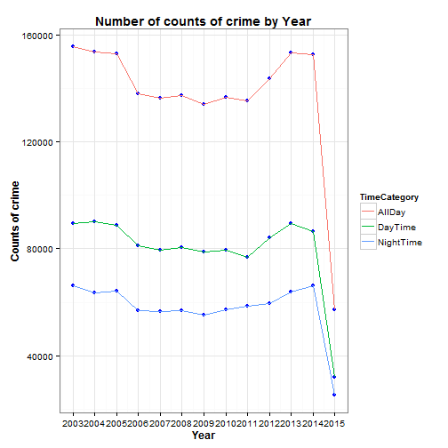

Coursera - Developing Data Products Project
========================================================
author: Huang Yinning
date: 22/Jun/2015

San Francisco Crime Data Explorer
========================================================

From 1934 to 1963, San Francisco was infamous for housing some of the world's most notorious criminals on the inescapable island of Alcatraz.

Today, the city is known more for its tech scene than its criminal past. But, with rising wealth inequality, housing shortages, and a proliferation of expensive digital toys riding BART to work, there is no scarcity of crime in the city by the bay.

About the dataset
========================================================

- From Sunset to SOMA, and Marina to Excelsior, the dataset taken from Kaggle's competition provides nearly 12 years of crime reports from across all of San Francisco's neighborhoods.

- However, in order to shorten the processing time, only 10% of the data is randomly sampled to illustrate the use of this data explorer app


Column names of dataset
========================================================


```r
training <- read.csv("./data/training.csv")
names(training)
```

```
[1] "Dates"      "Category"   "Descript"   "DayOfWeek"  "PdDistrict"
[6] "Resolution" "Address"    "X"          "Y"         
```


Build Cool plot like this using the app!!
========================================================

 

